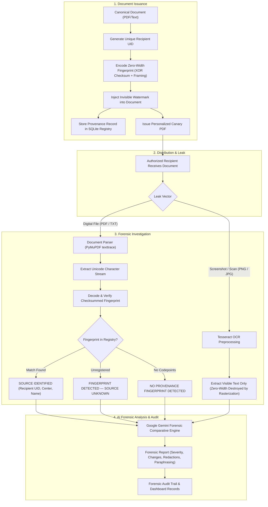

# CANARYDOCS

> **A forensic document provenance and leak investigation platform that turns recovered documents into traceable digital evidence.**

[](https://www.python.org/)
[](https://streamlit.io/)
[](https://ai.google.dev/)
[](https://pymupdf.readthedocs.io/)
[](tests/)

---

## Overview

When organizations distribute confidential assets—such as national examination papers, competitive intelligence, legal disclosures, or board resolutions—they must often provide distinct authorized copies to dozens or hundreds of internal and external parties. If a document subsequently leaks to the public or press, security teams face two critical challenges:

1. **Attribution Blind Spot:** Standard digital copies appear identical. Determining which specific recipient received the leaked copy is virtually impossible without embedded provenance.
2. **Impact & Modification Blind Spot:** Leaked copies are rarely pristine; they are often selectively redacted, reformatted, cropped, or paraphrased to obscure origins or mislead investigators.

**CANARYDOCS** solves both challenges by combining:
- **Recipient-Specific Digital Document Fingerprints:** Invisible, zero-width steganographic markers uniquely tied to authorized recipients.
- **Deterministic Provenance:** Cryptographically framed and checksummed watermark recovery mapped directly against a persistent SQLite registry.
- **Full PDF/TXT Investigation:** Character-stream and font-layer extraction via PyMuPDF that recovers embedded fingerprints from leaked digital files.
- **OCR Investigation for Image & Screenshot Leaks:** Optical character recognition via Tesseract for rasterized captures, accompanied by strict architectural boundaries acknowledging physical rasterization limitations.
- **Gemini-Powered Forensic Content Analysis:** AI-assisted comparative evaluation that highlights textual deltas, semantic drift, redactions, and security severity without speculating on leaker identity.
- **Tamper-Evident Forensic Records:** Comprehensive audit logging tracking every document issuance, recipient identity, and fingerprint token with immutable timestamps.

---

## The Problem

Conventional document management and distribution workflows treat identical documents uniformly. When leaks occur, traditional approaches break down:

- **Visible Watermarks Are Easily Defeated:** Obvious visual stamps (e.g., "CONFIDENTIAL - JOHN DOE") are readily cropped, masked, or erased using standard PDF editing tools.
- **Metadata Is Ephemeral:** File metadata (EXIF, PDF author tags, creation timestamps) is automatically stripped upon uploading to messaging apps, social networks, or cloud platforms.
- **Manual Document Comparison Is Inefficient:** Security officers reviewing a multi-page leak must manually compare lines against master copies, making it difficult to detect subtle deletions, numerical alterations, or strategic paraphrasing.
- **Speculative Attribution Risks Injustice:** Pointing fingers based on circumstantial suspicion or AI hallucination introduces severe legal and organizational risks. Attribution must be strictly mathematical and verifiable.

---

## Our Solution

CANARYDOCS establishes an ironclad, dual-layer forensic architecture:

```
┌────────────────────────────────────────────────────────────────────────┐
│                               CANARYDOCS                               │
├───────────────────────────────────┬────────────────────────────────────┤
│   LAYER 1: DETERMINISTIC PROVENANCE│ LAYER 2: AI FORENSIC ANALYSIS     │
│   (Zero-Width Steganography + SQL)│ (Google Gemini 2.5 Flash)          │
├───────────────────────────────────┼────────────────────────────────────┤
│ • Zero-width Unicode encoding     │ • Comparative textual diffing      │
│ • Framing & XOR checksum check    │ • Semantic drift / Paraphrasing    │
│ • SQLite registry lookup          │ • Selective redaction detection    │
│ • Mathematical source attribution │ • Evidence-grounded severity score │
│ • NEVER guesses recipient identity │ • Strictly advisory analysis       │
└───────────────────────────────────┴────────────────────────────────────┘
```

### 1. Deterministic Provenance
- **Zero-Width Unicode Fingerprinting:** Custom bit-packing translates recipient identifiers into invisible Unicode codepoints (`\u200b`, `\u200c`, `\u200d`, `\ufeff`).
- **Framing & Checksum Verification:** Payloads include strict start/end framing markers, version flags, length headers, and an 8-bit XOR checksum to detect truncation or tampering.
- **Database Mapping:** Extracted tokens are queried against an ACID-compliant SQLite registry containing issuance timestamps, recipient UIDs, and document IDs.
- **Mathematical Attribution:** Recipient identification is binary and indisputable—either the checksummed fingerprint validates against a registered issuance record, or it does not.

### 2. AI-Assisted Forensic Analysis
- **Canonical vs. Leaked Comparison:** Feeds canonical baseline text and recovered leak text to Google Gemini.
- **Content Change Extraction:** Highlights concrete deletions, additions, and altered passages.
- **Redaction & Paraphrasing Detection:** Detects withheld sections and flags potential semantic rewriting.
- **Evidence-Based Severity:** Evaluates information exposure and assigns a calibrated security severity rating (`LOW`, `MEDIUM`, `HIGH`, `CRITICAL`) with confidence and quality scores.

> [!IMPORTANT]
> **Separation of Concerns:** Google Gemini **NEVER** determines or guesses the identity of the source recipient. Identity attribution comes solely from deterministic fingerprint validation and SQLite registry lookups. Gemini only evaluates content deltas and breach impact.

---

## How It Works

### End-to-End Forensic Workflow



### The Screenshot & OCR Fallback Pathway
Zero-width Unicode characters carry zero visual geometry and render no physical pixels. Rasterization (screen captures, mobile photos, image compression) permanently destroys zero-width character streams. 

CANARYDOCS addresses this transparently:
- **Digital PDFs / TXTs:** Undergo automated steganographic extraction and deterministic source attribution.
- **Images / Screenshots:** Processed via Tesseract OCR to extract visible text for comparative AI analysis, with clear UI disclaimers that rasterization destroys zero-width markers.

---

## Key Features

- **Personalized Document Generation:**
  - Create official-style PDFs with embedded TrueType Unicode fonts using `fpdf2`.
  - In-situ watermarking for user-uploaded PDFs via `PyMuPDF`, preserving multi-page geometry and visual elements while embedding recipient markers.
- **Robust Zero-Width Steganography:**
  - 2-bit symbol mapping using invisible Unicode codepoints (`\u200b`, `\u200c`, `\u200d`, `\ufeff`).
  - Bit-packed framing containing protocol version, payload length, raw data, and 8-bit XOR checksum validation to detect tampering.
- **Deep Document Parsing:**
  - Extraction via PyMuPDF using character-level `get_texttrace()` to capture consecutive zero-width codepoints that standard layout scrapers discard.
- **SQLite Provenance Registry:**
  - Relational tracking of documents, recipients, and issued fingerprints with foreign key constraints.
  - O(1) indexed lookups for recovered fingerprint tokens.
- **Tesseract OCR Integration:**
  - Grayscale conversion, contrast enhancement, and threshold preprocessing via Pillow (`PIL`).
  - Graceful fallback and clear architectural messaging when running without local OCR binaries.
- **AI Forensic Analysis (Google Gemini):**
  - Comparative analysis identifying content drift, withheld sections, and semantic changes.
  - Structured output schemas with fallback resilience against malformed responses or network errors.
- **Calibrated Severity Classification:**
  - Categorizes incidents into `LOW`, `MEDIUM`, `HIGH`, or `CRITICAL`.
  - Reports `severity_confidence` (`LOW`/`MEDIUM`/`HIGH`), `evidence_quality` (`LOW`/`MEDIUM`/`HIGH`), and a detailed `severity_basis` list.
- **Audit Registry & Analytics Dashboard:**
  - Real-time KPI metrics (documents issued, registered recipients, active fingerprints).
  - Searchable audit log joining document titles, recipient identities, and issuance timestamps.
  - Document catalog management with cascading deletion protection.

*(Note: CANARYDOCS intentionally relies on local session isolation; complex enterprise authentication/RBAC is omitted in favor of a lean, self-contained forensic runtime.)*

---

## Investigation Results

When an investigator submits a leaked document, CANARYDOCS outputs one of three formal forensic states:

| Status | Meaning | System Response |
| :--- | :--- | :--- |
| **`SOURCE IDENTIFIED`** | A valid zero-width fingerprint was recovered, its checksum verified, and its payload matched an authorized recipient in SQLite. | Displays recipient name, UID, organization center, document metadata, and issuance timestamp. |
| **`FINGERPRINT DETECTED — SOURCE UNKNOWN`** | A valid zero-width fingerprint was extracted and checksum-verified, but no matching issuance record exists in SQLite. | Alerts investigator that the document carries a CANARYDOCS payload that was either issued outside the current database or manually injected. |
| **`NO PROVENANCE FINGERPRINT DETECTED`** | No valid CANARYDOCS framing markers or Unicode zero-width sequences were detected in the file. | Notifies investigator that no steganographic markers were found. |

> [!WARNING]
> **Forensic Principle:**  
> **"No provenance fingerprint detected" does NOT mean "no leak occurred."**  
> It simply indicates that the submitted file does not contain a verifiable CANARYDOCS digital fingerprint (e.g., the text was retyped from scratch, sanitized through a plain ASCII converter, or originated from an unwatermarked source).

---

## AI Forensic Analysis

Once text is recovered (from digital extraction or OCR), the Gemini analysis layer evaluates the scope and security implications of the breach:

- **Severity Rating (`LOW`, `MEDIUM`, `HIGH`, `CRITICAL`):**
  - **`LOW`:** Typographical changes, OCR scanning noise, formatting differences, non-sensitive edits.
  - **`MEDIUM`:** Noticeable substantive changes, limited redactions, moderate semantic drift.
  - **`HIGH`:** Substantial exposure of sensitive or confidential sections, significant unauthorized modifications.
  - **`CRITICAL`:** Broad or near-complete disclosure of classified material with extreme institutional impact.
- **Severity Confidence & Evidence Quality:** Quantifies the model's certainty and the integrity of the extracted text (e.g., degraded for noisy OCR inputs).
- **Severity Basis:** A list of concrete, evidence-backed justifications citing specific differences observed between texts.
- **Content Changes:** Itemized summary of factual discrepancies, omissions, and insertions.
- **Possible Redactions:** Flags whether confidential clauses, names, or values were intentionally censored.
- **Possible Paraphrasing:** Assesses whether the text was rephrased or restyled to disguise the source document.
- **Actionable Recommendations:** Suggests targeted incident response protocols (e.g., credential revocation, distribution list audits, physical evidence collection).

> [!NOTE]
> **Advisory Boundary:** Gemini forensic evaluations are strictly advisory. AI cannot prove malicious intent or legally certify that an LLM was used for rewriting.

---

## Technology Stack

The project relies on a clean, modern, lightweight Python ecosystem without heavyweight microservices or distributed infrastructure:

| Technology | Purpose in CANARYDOCS |
| :--- | :--- |
| **Python 3.11+** | Core runtime and backend logic |
| **Streamlit (>=1.35.0)** | Reactive forensic investigator dashboard and UI |
| **SQLite3** | ACID-compliant relational provenance registry and audit storage |
| **Google Gemini (`google-genai` >=0.1.1)** | Forensic comparative diffing, severity scoring, and impact analysis |
| **PyMuPDF / `fitz` (>=1.24.0)** | PDF texttrace extraction and in-situ zero-width watermark injection |
| **`fpdf2` (>=2.7.0)** | Generation of canary test documents with TrueType Unicode font embedding |
| **Pillow (`PIL` >=10.0.0)** | Forensic image preprocessing (grayscale, contrast, thresholding) |
| **`pytesseract` (>=0.3.10)** | Optical Character Recognition for leaked screenshots and scans |
| **`pytest` (>=8.0.0)** | Unit, contract, and end-to-end integration test suite (101 passing tests) |
| **`python-dotenv` (>=1.0.0)** | Safe environment configuration and API key management |

---

## Architecture

The codebase follows a modular design with clear boundaries between steganography, persistence, document parsing, and AI analysis:

```
hack/
├── app.py                 # Streamlit UI orchestrating issuance, triage, analysis & audits
├── models.py              # Domain dataclasses: Recipient, Document, InvestigationResult, ForensicReport
├── database.py            # SQLite database layer; the ONLY module that executes SQL queries
├── fingerprint.py         # Zero-width Unicode encoding, decoding, framing, and XOR checksum validation
├── pdf_generator.py       # Canary PDF creation (fpdf2) and in-situ PDF watermark injection (PyMuPDF)
├── document_parser.py     # Text extraction from PDF (PyMuPDF texttrace) and TXT files
├── investigator.py        # Central leak triage coordinator resolving fingerprints against SQLite
├── ocr_service.py         # Image preprocessing and Tesseract OCR extraction for screenshots
├── gemini_service.py      # Google Gemini integration, prompt engineering, and forensic parsing
├── seed_data.py           # Demonstration database seeder containing mock national exam fixtures
├── data/                  # SQLite persistent storage directory (canarydocs.db)
└── tests/                 # Comprehensive pytest test suite (101 unit and integration tests)
```

---

## Installation

### Prerequisites
- Python 3.11 or higher
- *(Optional)* Tesseract OCR installed on the system (for image screenshot analysis)
  - **Ubuntu/Debian:** `sudo apt-get install tesseract-ocr`
  - **macOS:** `brew install tesseract`
  - **Windows:** Download installer from [UB-Mannheim/tesseract](https://github.com/UB-Mannheim/tesseract/wiki)

### Setup Instructions

1. **Clone the repository:**
   ```bash
   git clone <repository-url>
   cd canarydocs
   ```

2. **Create and activate a virtual environment:**
   ```bash
   # On macOS / Linux:
   python -m venv .venv
   source .venv/bin/activate

   # On Windows (Command Prompt / PowerShell):
   python -m venv .venv
   .venv\Scripts\activate
   ```

3. **Install dependencies:**
   ```bash
   pip install -r requirements.txt
   ```

4. **Configure environment variables:**
   ```bash
   cp .env.example .env
   ```
   Add your Google Gemini API key to `.env` (optional, can also be entered directly in the Streamlit UI):
   ```ini
   GEMINI_API_KEY=your_gemini_api_key_here
   ```

5. **Run the test suite:**
   Verify that all components and contracts are working:
   ```bash
   pytest -v
   ```

6. **Launch CANARYDOCS:**
   ```bash
   streamlit run app.py
   ```
   The application will automatically initialize the SQLite database and seed mock demonstration documents on first launch.

---

## Hackathon Demonstration Guide

To demonstrate the full end-to-end workflow to judges in under 3 minutes:

1. **Issue a Canary Document:**
   - Navigate to `📄 Document Issuance`.
   - Select the **NEET UG 2026 Biology Subset** and recipient **Dr. Rajesh Sharma (UID: `NEET-DEMO-042`)**.
   - Click **Generate Personalized Canary Document** and download the PDF.
2. **Simulate a Leak Investigation:**
   - Navigate to `🔍 Leak Investigation`.
   - Upload the downloaded Canary PDF (or use the instant transfer button).
   - Observe immediate attribution: **`SOURCE IDENTIFIED`** pointing to Dr. Rajesh Sharma.
3. **Execute AI Forensic Analysis:**
   - Click **Proceed to AI Forensic Analysis**.
   - Run the Gemini evaluation to inspect the severity rating, confidence level, textual differences, and actionable recommendations.
4. **Test Screenshot / OCR Boundaries:**
   - Upload a screenshot of the document in `🔍 Leak Investigation`.
   - Observe how the OCR engine extracts visible text while explaining the physical limitations of rasterization on invisible codepoints.

---

## License

This project is licensed under the MIT License. Fictional examination contents and institutional references in demo fixtures are used purely for cybersecurity demonstration purposes.